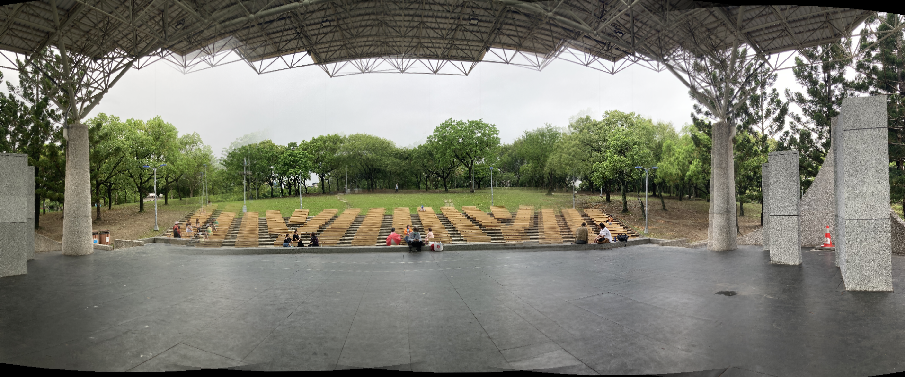
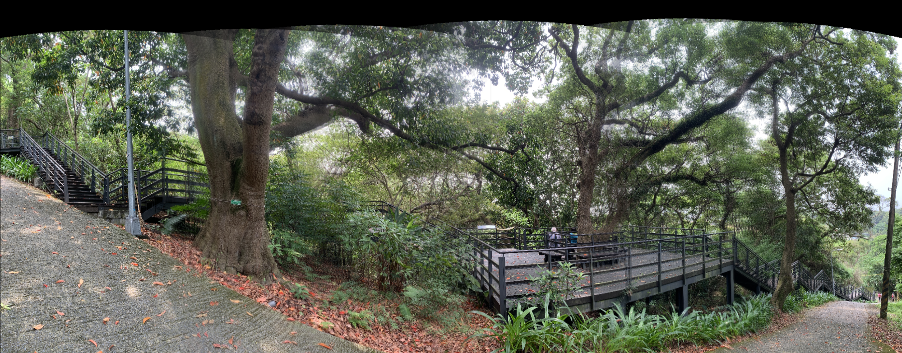
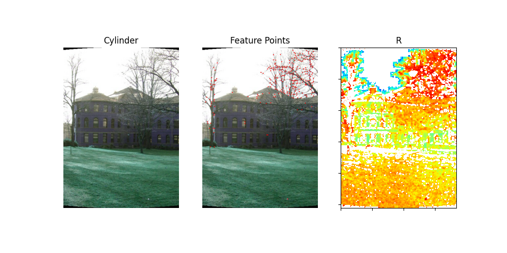
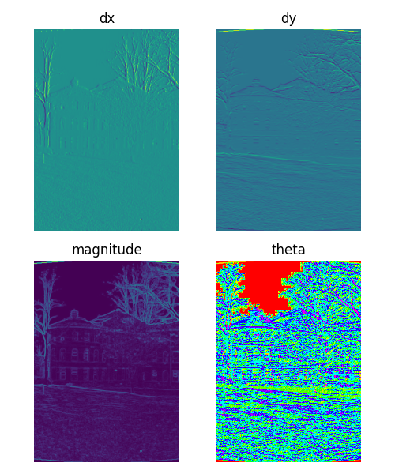
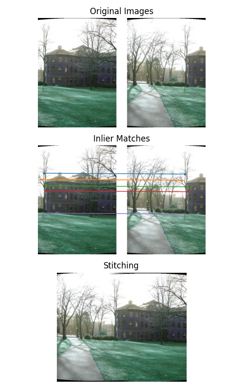

# Image Stitching
Image stitching is a technique to combine a set of images into a larger image, and one of its popular applications is the creation of panoramas. 
In this project, we implemented a feature-based method of image stitching, there are basically five components, feature detection, feature matching, image matching, bundle adjustment and blending.

## Usage
To run this project, you'll need to provide the input images and a txt file that records all focal lengths of images, which can be obtained using the old 32-bit Windows version of [autostitch](http://matthewalunbrown.com/autostitch/autostitch.html)
```
[input_directory]/
├──[image1]
├──[image2]
├──...
└──pano.txt
```
And then run
```
python3 main.py --src_dic [input_directory]
```

## Advanced Usage
```
python3 main.py --help
```

## Sample Results 
```
python3 main.py --src_dir ./data/parrington
```


```
python3 main.py --src_dir ./data/DaAn
```


```
python3 main.py --src_dir ./data/trees
```


## Visualization


